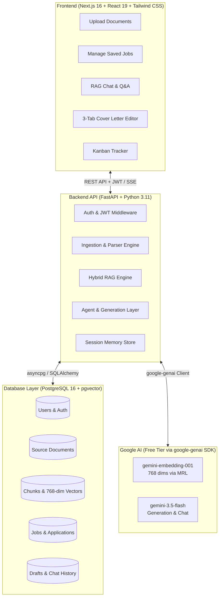

# JobPilot v2 — AI Job Application Assistant

> **An AI-powered job application assistant and career copilot powered 100% by Google's Free Gemini API, PostgreSQL + pgvector, FastAPI, and Next.js 16.**

[](https://github.com/Adithya1756/JobPilot/actions)
[](https://opensource.org/licenses/MIT)
[](https://github.com/Adithya1756/JobPilot/releases)

---

## 1. Executive Summary

**JobPilot v2** is a production-grade, full-stack AI career assistant that streamlines the entire job search and application lifecycle. It ingests your unstructured career documents (resumes, project portfolios, performance reviews, cover letters), converts them into searchable knowledge using semantic chunking and vector embeddings, and leverages **Hybrid Retrieval-Augmented Generation (RAG)** to draft hyper-tailored cover letters and answer application questions grounded strictly in your real-world experience.

### What Makes v2 Special?
- **100% Free-Tier AI Stack**: Completely eliminates expensive multi-vendor API dependencies (OpenAI, Anthropic, Cohere, Pinecone). The entire AI pipeline runs on a single free Google Gemini API key from [Google AI Studio](https://aistudio.google.com/apikey).
- **Hybrid RAG (Vector + Keyword + RRF)**: Combines dense vector semantic similarity (`gemini-embedding-001` via `pgvector`) with sparse full-text search (`tsvector` + GIN) merged via Reciprocal Rank Fusion (RRF), ensuring exact technical keywords (e.g., "Kubernetes", "Next.js", "CI/CD") are never missed.
- **Strict Grounding & Zero Hallucination**: Generation prompts enforce that the LLM drafts content *only* using retrieved career fragments and explicitly references source chunks.
- **Full Application Lifecycle Tracking**: Integrated Kanban board for tracking applications across 6 stages with integrated interview scheduling and follow-up logging.
- **Graceful Degradation**: If an API key is missing or rate-limited, the system falls back seamlessly without crashing.

---

## 2. End-to-End System Architecture



---

## 3. Core Features & Capabilities

### 📄 1. Intelligent Career Document Ingestion
- **Multi-Format Support**: Upload files in `.pdf`, `.docx`, `.txt`, and `.md` formats.
- **Table-Aware Parsing**: Uses `pdfplumber` for PDFs (extracting structured tables often used in modern resumes) and `python-docx` for Word documents.
- **Semantic Section Chunking**: Unlike naive token-based chunking that cuts sentences or bullet points in half, JobPilot detects semantic section headers (`Work Experience`, `Education`, `Technical Skills`, `Projects`, `Certifications`) and splits experience entries by employer/role. This guarantees that achievements and their metrics stay together.
- **Vector Embedding**: Each chunk is embedded into a 768-dimensional vector using `gemini-embedding-001` via Matryoshka Representation Learning (MRL).

---

### 🔍 2. Hybrid RAG Search Engine
Vector search alone often struggles with exact acronyms or specific technical versions (e.g., `ISO 27001`, `OAuth 2.0`, `PyTorch 2.0`). JobPilot v2 implements **Hybrid Search**:

1. **Dense Vector Search**: Computes cosine distance (`<=>`) against the stored 768-dimensional embeddings using an HNSW index in PostgreSQL.
2. **Sparse Keyword Search**: Executes full-text search against the `tsvector` column using PostgreSQL's GIN index and `ts_rank`.
3. **Reciprocal Rank Fusion (RRF)**: Merges the ranked lists using:
   $$RRF(d) = \sum_{m \in M} \frac{1}{k + \text{rank}_m(d)} \quad (k = 60)$$
   This produces a single, balanced ranking without requiring complex score normalization between bounded vector distances and unbounded BM25/FTS scores.

---

### ✍️ 3. AI Cover Letter & Application Drafting
- **Job Description Analysis**: Analyzes target company name, role title, and requirements.
- **Context-Augmented Generation**: Retrieves the top-8 most relevant chunks from your resume and career history.
- **Strict Grounding**: Uses `gemini-3.5-flash` with a tailored career coaching prompt that:
  - Writes a concise, impact-focused cover letter (250–350 words).
  - Emphasizes quantified achievements matching the job description.
  - Forbids fabricating experience or metrics.
- **Provenance & Chunk Citations**: Every generated draft stores the exact chunk IDs used in PostgreSQL (`retrieved_chunk_ids`), giving you full visibility into what past experience the AI referenced.
- **Real-Time Streaming**: Supports Server-Sent Events (SSE) at `POST /agent/draft/stream` for live feedback during retrieval and generation.

---

### 💬 4. Document-Grounded RAG Chat Assistant
- An interactive career chat copilot (`POST /agent/chat`).
- Ask questions like:
  - *"What are my strongest talking points for a Senior Backend role at Stripe?"*
  - *"How should I explain my transition from data engineering to distributed systems?"*
  - *"Summarize all my cloud infrastructure and Kubernetes experience."*
- Augments queries with relevant resume chunks and recent conversation history stored in PostgreSQL.

---

### 📋 5. Kanban Application Tracker
A complete visual pipeline to manage your active job hunt:
- **6 Pipeline Stages**:
  1. `Saved` (interested roles)
  2. `Applied` (submitted application)
  3. `Interview` (screening, technical, or final rounds)
  4. `Offer` (offers received)
  5. `Rejected`
  6. `Withdrawn`
- **Actions per Card**: Move across stages, add custom notes, link directly to draft cover letters, and log follow-up dates.

---

### 📝 6. Three-Tab Cover Letter Editor
Built into the frontend at `/cover-letter/[draftId]`:
1. **Editor Tab**: Full-screen markdown/text editor with live word count, character count, copy-to-clipboard, and instant database save.
2. **References Tab**: Displays all retrieved chunks that influenced the letter with similarity scores and section source tags.
3. **Critique Tab**: Provides AI self-evaluation scores, identified strengths, areas for improvement, and missing skill suggestions.

---

### 🛡️ 7. Authentication & Security
- **Stateless JWT Authentication**: Access tokens (30-min expiry) and Refresh tokens (7-day expiry) signed with `HS256`.
- **Password Security**: Passwords hashed using `bcrypt`.
- **Data Isolation**: Strict multi-tenant security — every document, chunk, job, draft, and chat message is keyed by `user_id` with cascading deletes.

---

## 4. Technical Stack

| Layer | Technology | Details |
|---|---|---|
| **Frontend Framework** | Next.js 16 (App Router) | React 19, TypeScript 5, Turbopack |
| **Styling & UI** | Tailwind CSS v4 + Radix UI | shadcn/ui primitives, Lucide Icons |
| **Backend Framework** | FastAPI (Python 3.11) | Async ASGI architecture with Uvicorn |
| **Database & Vector DB** | PostgreSQL 16 + pgvector | HNSW cosine vector index + GIN FTS index |
| **ORM & Migrations** | SQLAlchemy 2.0 (Async) + Alembic | Async connection pooling with `asyncpg` |
| **LLM Provider** | Google Gemini (`google-genai` SDK) | `gemini-3.5-flash` (Free Tier) |
| **Embeddings Provider** | Google Gemini (`google-genai` SDK) | `gemini-embedding-001` (768 dims via MRL) |
| **Document Parsers** | `pdfplumber`, `python-docx` | Table-aware text extraction |
| **Auth** | `python-jose`, `passlib[bcrypt]` | JWT Bearer Token Strategy |

---

## 5. Database Schema (PostgreSQL + pgvector)

- **`users`**: UUID primary key, indexed unique email, bcrypt password hash, name, role.
- **`source_documents`**: Uploaded file metadata, raw text, and link to parent user.
- **`chunks`**: Vector RAG storage (`content`, `embedding Vector(768)`, `tsv Text`, `metadata JSONB`).
- **`jobs`**: Job postings (`company_name`, `role_title`, `job_description`, `source_url`).
- **`applications`**: Kanban tracker (`status` enum, `applied_at`, `follow_up_date`, `notes`).
- **`generated_drafts`**: AI deliverables (`draft_type`, `content`, `retrieved_chunk_ids JSONB`, `user_edited_content`).
- **`chat_messages`**: Conversational session logs (`session_id`, `role`, `content`).

---

## 6. How to Run & Use JobPilot v2

### Prerequisites
- Docker (for PostgreSQL + pgvector)
- Python 3.11+
- Node.js 20+
- Free Gemini API Key from [Google AI Studio](https://aistudio.google.com/apikey)

### Step 1: Start PostgreSQL
```bash
docker compose up -d postgres
```

### Step 2: Configure & Start Backend
```bash
cd backend

# Create .env from template
cp .env.example .env

# Add your GEMINI_API_KEY to backend/.env:
# GEMINI_API_KEY=AIzaSy...

# Install dependencies & run migrations
pip install -r requirements.txt
alembic upgrade head

# Start FastAPI server
python3 -m uvicorn app.main:app --reload --port 8000
```
- Interactive Swagger API docs available at: **`http://localhost:8000/docs`**

### Step 3: Start Frontend
```bash
cd frontend
npm install
npm run dev
```
- Web Application available at: **`http://localhost:3000`**

---

## 7. Cost & Rate Limits (100% Free)

| Service | Limit / Quota | Cost |
|---|---|---|
| **gemini-3.5-flash** | 15 Requests/Min, 1,500 Requests/Day, 1M Tokens/Min | **$0.00 / Free** |
| **gemini-embedding-001** | 1,500 Requests/Day, 1M Tokens/Min | **$0.00 / Free** |
| **PostgreSQL + pgvector** | Self-hosted via Docker or free tier Neon | **$0.00 / Free** |
| **Next.js Frontend** | Local or Vercel Hobby Tier | **$0.00 / Free** |
| **Total Operating Cost** | | **$0.00 / month** |
